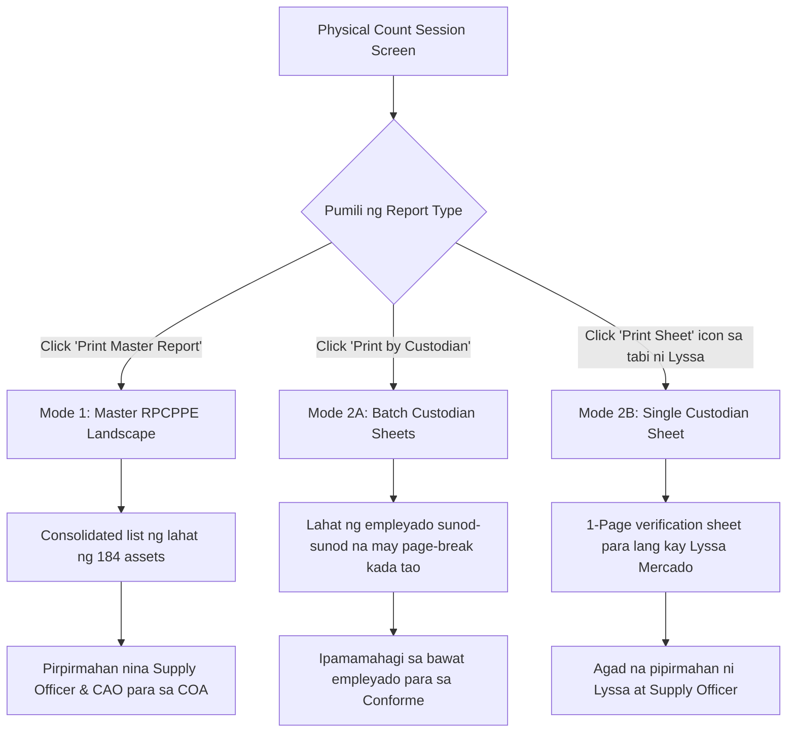

# Physical Count — Custodian Group Counting

**Status:** Implemented
**Date:** 2026-09-02
**Related:** `docs/PM_REPAIR_PARTS_REQUISITION.md`, QR Sticker system

---

## 1. Design Decisions (agreed with user)

| Decision | Rationale |
|---|---|
| **Asset QR = permanent identity** | The physical sticker is per-asset (`/r/{asset_id}`), printed **once**, never re-printed due to reassignment. Tag follows the asset, not the person. COA-aligned (property tagging is per-item). |
| **Set QR = parent only (1 print = whole set)** | For parent-child sets (`parent_asset_id`), **one sticker on the parent** = access to the whole linked set via the scan hub (§9). Components carry **no separate sticker** — their identity lives under the parent. Extends the "printed once / no reprints" rule. |
| **No new sticker type** | No per-person / per-division QR. No new routes, no QR payload changes. |
| **Person grouping lives in software** | The Physical Count page can search by custodian name and count the custodian's whole assigned set at once. Digital equivalent of a PAR-based annual inventory (COA workflow). |
| **Assigned assets only** | Group results exclude unassigned/spare assets and `For Disposal` / `Scrapped` items. |
| **Live grouping** | Group is computed at scan/search time from `assigned_to_user` — new/removed/transferred assets auto-reflect. No reprints ever. |
| **Immutable marks preserved** | Existing rule: an asset already counted in a session cannot be re-marked (422). Bulk "Mark all Present" treats 422 as *skip*, not error. |

## 2. Roles / Access

Feature is confined to the Supply Office workflow — no other role sees any change.

| Role | Group Counting | Mark All | Complete Batch List |
|---|---|---|---|
| Supply Officer | ✅ | ✅ | ✅ |
| Division Admin (`can_supply`) | ✅ (branch-scoped) | ✅ | ✅ |
| Division Admin (no supply) | ❌ 403 | ❌ | ❌ |
| Super Admin | ❌ (`role:admin` excludes — existing deliberate design) | ❌ | ❌ |
| IT / End User / Guest | ❌ | ❌ | ❌ |

## 3. What Was Already There (discovered during review)

- `SearchPhysicalCountAssetAction` already returned `user_assets` + `scanned_user_id` on asset-ID scans — the **scanner flow** (QR → "Other Assets of {name}" card with per-asset mark buttons) was already working.
- `InventoryAsset::components()` / `parentAsset()` / `AssetSetIntegrityService` exist (parent-child sets) — not needed for this feature but noted.
- `ShowPhysicalCountAction` computes session totals **live** (not snapshot) — progress auto-adjusts when assets are added/removed mid-session.

## 4. Changes Implemented

### 4.1 `app/Actions/PhysicalCount/SearchPhysicalCountAssetAction.php`
- **Person-name search:** text query now also matches `assignedUser.full_name` (previously only asset fields — typing "Maria" found nothing).
- **Custodian group:** when the query matches **exactly one user**, response includes a new backward-compatible field:
  ```json
  "custodian_group": {
      "user_id": 42,
      "full_name": "Maria Santos",
      "total": 5,
      "assets": [ ... assigned-only, scope-checked, no For Disposal/Scrapped, no 20-limit ... ]
  }
  ```
  Multiple user matches → `custodian_group: null` (flat list only, prevents wrong bulk-marking).
- **Scope fix:** the pre-existing `user_assets` query had **no `InventoryScope`** (cross-branch leak for super-admin-context users). Both `user_assets` and `custodian_group` queries are now scope-checked.

### 4.2 `resources/views/inventory/physical-count-show.blade.php`
- Group checklist UI: custodian header + per-asset Present/Missing buttons + **"Mark all as Present (n)"** bulk button.
- `markMany(ids)`: sequential POSTs to the **existing** `/mark` endpoint, `Swal` progress, summary ("4 marked, 1 already counted"). **Updated (Phase 2, `719045b`):** wala nang `location.reload()` — **in-place DOM update** (group counters, stats bar, pagtanggal ng na-count na row); ang 422 ("already counted") ay **ina-adopt na counted** (`pcAdoptCounted`) para walang buttons na maiiwan at agad magsasara ang scanned card.
- Flat search results show the custodian name per item when several users match the query.

### 4.3 `resources/views/inventory/qr-batch.blade.php`
- **Pagination fix:** replaces single `inventory.data` fetch (first 50/100 only) with a paged loop (`per_page=100` until `last_page`) so the complete asset list is printable. Loading progress shown per page.
- Removed duplicate `data-id` attribute in the row template.

## 5. What Was NOT Changed (verified safe)

- `MarkPhysicalCountAssetAction` — immutability + audit log already correct.
- `QrCodeService`, `/r/{id}` route, `ScanController`, `scan/asset-info` — asset QR flows untouched.
- `ShowPhysicalCountAction` — live totals already correct.
- Route middleware — `role:admin` semantics preserved.

## 6. Verification (phase-by-phase)

### Phase 1-2: Backend group search + Count page UI — ✅ TESTED
`tests/Feature/PhysicalCountGroupTest.php` — **7 passed, 23 assertions**:
- ✓ Unique custodian name match returns group (assigned-only, no For Disposal/Spare/Scrapped)
- ✓ Multiple name matches → no group (flat list only)
- ✓ Group is scoped to actor branch (cross-branch assets excluded)
- ✓ Plain asset search → no group
- ✓ Search requires `canProcessSupply` (end user → 403)
- ✓ Mark-then-remark rejected (422) — bulk skip semantics verified
- ✓ Completed session rejects search (422)
- Blade compiles clean (`view:cache`), zero-width char scan: 0

### Phase 3: QR Batch pagination fix — ✅ TESTED
- `test_qr_batch_page_loads_with_paged_loader_for_supply_role` — batch page renders with paged loader (`per_page=100` loop)
- Duplicate `data-id` attribute removed from row template
- **Full regression suite: 222 passed, 857 assertions, 0 failures**

### Phase 4-6: Gap closure — main table, print report, export — ✅ TESTED
**Gap A:** Main table sa show page ay **grouped by custodian na** (accordion-style blocks: name + PAR + counted X/Y + per-group "Mark all Present" button sa header, 10 groups/page). assets grouped via shared `Concerns\BuildsCustodianGroups` trait; "Assigned To" column pinalitan ng "Category" (redundant na sa group header).
**Gap B:** **Print by Custodian** option (`?group=custodian`) — divider rows per custodian na may PAR + counted counts, plus **Custodian Conforme** signature section (certification text + signature line per custodian na may PAR). Default print (`?group=category`) unchanged — backward compatible.
**Gap C:** Per-custodian "Mark all Present" sa main view (hindi lang sa search) — reuses `markMany()`.
**Bonus:** CSV Export may **"Assigned To"** column na (PAR reconciliation).

Tests (`PhysicalCountGroupTest` — **12 passed, 42 assertions**):
- ✓ Show page renders custodian grouped table (+ Unassigned/Spare last group)
- ✓ Print by custodian: "Grouped by Custodian" + custodian name + PAR + conforme signatures
- ✓ Default print keeps category grouping (no conforme block)
- ✓ Export CSV includes "Assigned To" column (via `streamedContent()`)
- **Full suite: 225 passed (113 + 112 across two runs), 0 failures**

### Phase 7: Mobile walk-around UX (count show page) — ✅ TESTED
Mobile-only (`max-width: 767px` media query) — **desktop view untouched**:
- **Asset cards:** custodian table rows become stacked cards (thead hidden, `data-label` + `td::before` labels: SN/PAR/Property/Category) — **no horizontal scroll** (600px min-width overridden for custodian tables only)
- Counted rows: green/red card tint for instant visual state
- **Custodian header:** stacks; "Mark all Present" full-width 44px touch target
- **Sticky search/scan bar** — pinned below the sticky topbar (top: 58px), always reachable while walking
- **Scroll retention:** hindi na kailangan ang reload/`sessionStorage` — **in-place update** na ngayon ang `markAsset`/`markMany` (Phase 2, `719045b`) + scroll compensation (hindi tumatalon pataas); isinasara at awtomatikong binubuksan muli ang camera sa scanned card kapag ubos na ang pending
- Verified: blade compiles, zero-width chars 0, PhysicalCountGroupTest 12/12 passed

### Phase 9: Button polish + pagination split (user feedback) — ✅ TESTED
- **Scan QR:** "Scan QR Sticker" → **"Scan QR"** (button, modal title, placeholder); 50px height, radius 10
- **Complete Session:** walang icon, inalis ang inline styles — **eksaktong kapareho ng Scan QR button** (full-width, 50px, 15px font) sa mobile (`.btn-complete-session` + form `display:block` fix)
- **Pagination split:** desktop = standard Laravel links (pareho ng Inventory/Parts pages); mobile = Prev / Page X of Y / Next bar (`.pag-desktop-links` hidden sa mobile, `.pag-mobile-bar` hidden sa desktop)
- Verified: blade compiles, zero-width chars 0, PhysicalCountGroupTest 12/12 passed

### Phase 10-11: Desktop pagination + search bar redesign (user feedback) — ✅ TESTED
- **Desktop pagination:** custom styled (Parts-page look) — `Showing 1 to 10 of 32 custodians` + `‹ Prev [1] [2] [3] Next ›` navy active pill. Reason: `links()` Tailwind classes walang silbi (no Tailwind sa app). Mobile bar (Prev / Page X of Y / Next) — mobile only pa rin.
- **Search bar redesign (mobile + desktop):** search icon **sa loob ng input** (kaliwa), **X clear button sa loob din** (kanan) na lalabas lang kapag may typed text (typing/backspace aware), tinanggal ang hiwalay na "Clear" button
- **Complete Session:** walang icon, eksaktong kapareho ng Scan QR button (full-width, 50px) sa mobile; `form { display:block }` fix
- **Scan QR:** "Scan QR Sticker" → "Scan QR" (button, modal title, placeholder)
- Verified: blade compiles, PhysicalCountGroupTest 12/12 passed

## 7. Known Limits / Follow-ups

- Custodian group is bounded only by the custodian's assignment count (no artificial limit) — acceptable.
- Search throttle (`throttle:30,1`) applies as before; bulk marking posts sequentially to `/mark` under the same throttle.
- Super Admin access to Physical Count remains closed by design; opening it later is a separate decision (`role:admin,super_admin`).

---

## 8. Phase 12: Physical Count Reporting & Printing Overhaul (QR-Driven Reporting)

> **Date:** September 2026  
> **Status:** DESIGNED / DOCUMENTED (Awaiting User Execution Approval)  
> **Goal:** Gawing mabilis, kapaki-pakinabang, at direktang digital tool ng QR scanning ang Physical Count Reporting. Alisin ang mga komplikadong manu-manong papel na labas sa CMMS (blangkong checklist, maintenance forms, 50-person signature matrix), at ibigay ang parehong kailangan ng ahensya: **Master Inventory Report** at **Custodian Accountability Sheets**.

---

### 8.1 Core Principles (Pinagkasunduang Panuntunan)

1. **QR Code as the Primary Tool**:
   - Ang pag-iikot at pagbibilang sa opisina ay 100% digital gamit ang smartphone o barcode/QR scanner sa CMMS.
   - Ang report ay **hindi** form na pupunuan ng bolpen habang naglalakad; ito ay **opisyal na audit summary at patunay** ng kung ano ang na-scan at na-verify sa database.

2. **Pagtanggal sa mga Komplikado at Manu-manong Papel (No Out-of-System Bureaucracy)**:
   - ❌ **Alisin ang Blangkong Checkbox (`☐`)**: Nabilang na sa QR scanner, kaya digital status ang lalabas (`✔ Operational`, `⚠ Damaged`, `✖ Missing`, `— Uncounted`).
   - ❌ **Alisin ang 20-linyang Blangkong "Maintenance Findings" Worksheet (`_________________`)**: Ang ticketing o maintenance findings ay may sariling CMMS module; hindi kailangang mag-aksaya ng 1-2 pahina ng blangkong linya sa print.
   - ❌ **Alisin ang 50-person Signature Matrix Grid sa Dulo**: Hindi praktikal na pagsama-samahin ang 50 empleyado sa isang grid sa huling pahina kung saan walang nakakaalam kung anong asset ang pinipirmahan nila.
   - ❌ **Ayusin ang Hardcoded `Page 1`**: Gawing dynamic CSS page counters (`counter(page)` / `counter(pages)`).

3. **Dual-Report Architecture (Parehong Suportado: Master List at Custodian Sheets)**:
   - **Report A (Master Inventory Count Report)**: Para sa COA, Chief Administrative Officer (CAO), at Regional Director. Isang tuloy-tuloy na consolidated landscape listahan ng lahat ng assets.
   - **Report B (Custodian Accountability & Conforme Sheets)**: Para sa indibidwal na pananagutan ng empleyado (e.g. Lyssa Mercado). Suportado ang parehong **Batch by List** (isang print job para sa lahat ng may-ari ng gamit na may page-break bawat tao) at **Single On-Demand** (isang pindot lang para sa isang partikular na empleyado).

---

### 8.2 Disenyo at Visual Mockup ng Report A: Master Inventory Count Report (RPCPPE / COA)

- **Sino ang gagamit:** Commission on Audit (COA), Regional Director, CAO, Supply Officer.
- **Trigger:** Button sa toolbar: `[ 📄 Print Master Report ]`  
  - URL: `/inventory/physical-count/{id}/print`
- **Orientation:** A4 Landscape
- **Katangian:** Tuloy-tuloy na listahan ng lahat ng assets mula una hanggang huli, may buod ng bilang (KPIs), at pormal na pirma ng Inventory Committee at CAO.

#### Visual Layout Preview:
```text
+---------------------------------------------------------------------------------------------------------------+
| Republic of the Philippines                                                                                   |
| NATIONAL CONCILIATION AND MEDIATION BOARD                                                                     |
| Central Office / Regional Branch                                                                              |
|                                                                                                               |
|               REPORT ON THE PHYSICAL COUNT OF PROPERTY, PLANT AND EQUIPMENT (RPCPPE)                          |
|                                     As of September 08, 2026                                                  |
|                                                                                                               |
| Session: PC-2026-09-001  |  Branch: Central Office  |  Auditor: Juan Dela Cruz  |  Status: Completed          |
+---------------------------------------------------------------------------------------------------------------+
| TOTAL ASSETS: 184   |   PRESENT: 178 (96.7%)   |   DAMAGED: 4 (2.2%)   |   MISSING: 2 (1.1%)   |   NOT CTD: 0 |
+---------------------------------------------------------------------------------------------------------------+
| #  | Property No.         | Item Description          | Serial No.   | Category    | Custodian    | Status    |
+----+----------------------+---------------------------+--------------+-------------+--------------+-----------+
| 1  | SPHV-2025-08-022     | BROTHER ADS-4300N Scanner | BRO-99124    | ICT / Scan  | Lyssa Mercado| ✔ Present |
| 2  | SPHV-2024-07-032     | EPSON L3250 EcoTank       | EPS-44120    | ICT / Print | Lyssa Mercado| ✔ Present |
| 3  | 2022-05-03-0117-CMD  | HP PAVILION Desktop PC    | 4CE12399     | ICT / PC    | Lyssa Mercado| ✔ Present |
| 4  | 2022-05-03-0117-M1   | Monitor - HP 24-inch      | 3CQ88210     | Monitor     | Lyssa Mercado| ✔ Present |
| 5  | 2022-05-03-0117-M2   | Monitor - DELL 24-inch    | CN-08819     | Monitor     | Lyssa Mercado| ✔ Present |
| 6  | LT-LE-CMD-RJN20      | THINKBOOK N-1519 Laptop   | PF39281      | ICT / Laptop| Lyssa Mercado| ✔ Present |
| 7  | PMS-SPK-44           | Speaker - LOGITECH Z120   | —            | Peripheral  | Lyssa Mercado| ✔ Present |
| 8  | PMS-HP-7             | Headphones - CREATIVE     | —            | Peripheral  | Lyssa Mercado| ✔ Present |
| 9  | PMS-HP-18            | Headphones - JBL Quantum  | —            | Peripheral  | Lyssa Mercado| ✔ Present |
| 10 | 2021-03-0089-RO      | SHARP AR-6020 Photocopier | SHP-77112    | Office Eq   | Roberto Diaz | ✔ Present |
| 11 | 2023-11-0044-IT      | APC Smart-UPS 1500VA      | APC-00912    | ICT Power   | Roberto Diaz | ⚠ Damaged |
| ...| ...                  | ...                       | ...          | ...         | ...          | ...       |
+----+----------------------+---------------------------+--------------+-------------+--------------+-----------+

Certified Correct by:                                             Approved by:

________________________________________                          ________________________________________
JUAN DELA CRUZ                                                    ATTY. MARIA CONCEPCION
Supply Officer / Inventory Committee Chair                        Chief Administrative Officer (CAO)
Date: __________________________________                          Date: __________________________________

                                                                                     Page 1 of 6
```

---

### 8.3 Disenyo at Visual Mockup ng Report B: Custodian Accountability & Conforme Sheet

- **Sino ang gagamit:** Empleyado (End-user / Custodian) at Property/Supply Inspector.
- **Layunin:** Maging malinaw na patunay ng lahat ng gamit na nasa ilalim ng pananagutan ng isang empleyado pagkatapos ng QR scanning session. Dito direktang pipirma ang empleyado bilang **Conforme**.
- **Dalawang Paraan ng Pag-Print (Both Fully Supported):**
  1. **By List / Batch Print (`?group=custodian`)**:
     - I-print ang lahat ng mga empleyado sa isang bagsakan.
     - **CSS Rule:** Bawat empleyado ay may `page-break-after: always;` / `break-after: page;`.
     - *Kahalagahan:* Kahit 30 empleyado ang nasa session, hindi maghahalo ang kagamitan ni Lyssa Mercado at ni Roberto Diaz sa iisang papel. Bawat empleyado ay makakakuha ng sariling 1-pahinang (o 2-pahinang kung >15 items) verification sheet na may Conforme signature block.
  2. **Single On-Demand Print (`?group=custodian&user_id={id}`)**:
     - Pindutan sa tabi ng bawat custodian card sa show screen: `[ 🖨 Print Sheet ]`.
     - *Kahalagahan:* Kapag pumunta si Lyssa Mercado sa supply office, o kailangan lang papirmahan ang isang partikular na tao, hindi na kailangang i-print ang buong 50-person session. Direktang mai-print ang 1-page accountability sheet ni Lyssa lamang.

#### Visual Layout Preview (Base sa Tunay na Datos ni Lyssa Mercado - 9 Assets):
```text
+---------------------------------------------------------------------------------------------------------------+
| Republic of the Philippines                                                                                   |
| NATIONAL CONCILIATION AND MEDIATION BOARD                                                                     |
| Central Office - Administrative Division / Supply Section                                                     |
|                                                                                                               |
|                              PROPERTY CUSTODIAN VERIFICATION & CONFORME SHEET                                 |
|                                         Annual Physical Count 2026                                            |
+---------------------------------------------------------------------------------------------------------------+
| Custodian Name : LYSSA MERCADO                            | Session ID   : PC-2026-09-001                     |
| Division / Unit: Central Office / CMD                     | Date Verified: September 08, 2026                 |
| Total Assigned : 9 Property Items                         | Count Status : 9 of 9 Verified (100% Complete)    |
+---------------------------------------------------------------------------------------------------------------+

LIST OF ASSIGNED PROPERTIES / EQUIPMENT:
+----+----------------------+---------------------------+--------------+------------------+-----------+---------+
| #  | Property No.         | Item Description          | Serial No.   | PAR / ICS No.    | Category  | Status  |
+----+----------------------+---------------------------+--------------+------------------+-----------+---------+
| 1  | SPHV-2025-08-022     | BROTHER ADS-4300N         | —            | SPHV-2025-08-022 | Scanner   | ✔ Oper. |
| 2  | SPHV-2024-07-032     | EPSON L3250               | —            | SPHV-2024-07-032 | Printer   | ✔ Oper. |
| 3  | 2022-05-03-0117-CMD  | HP PAVILION Desktop       | —            | 2022-05-03-0117  | Desktop   | ✔ Oper. |
| 4  | 2022-05-03-0117-M1   | Monitor - HP              | —            | 2022-05-03-0117  | Monitor   | ✔ Oper. |
| 5  | 2022-05-03-0117-M2   | Monitor - DELL            | —            | 2022-05-03-0117  | Monitor   | ✔ Oper. |
| 6  | LT-LE-CMD-RJN20      | THINKBOOK N-1519          | —            | LT-LE-CMD-RJN20  | Laptop    | ✔ Oper. |
| 7  | PMS-SPK-44           | Speaker - LOGITECH        | —            | PMS-SPK-44       | Peripheral| ✔ Oper. |
| 8  | PMS-HP-7             | Headphones - CREATIVE     | —            | PMS-HP-7         | Peripheral| ✔ Oper. |
| 9  | PMS-HP-18            | Headphones - JBL          | —            | PMS-HP-18        | Peripheral| ✔ Oper. |
+----+----------------------+---------------------------+--------------+------------------+-----------+---------+

REMARKS / VERIFICATION NOTES:
All 9 items scanned and accounted for in Central Office Room 302. In good working condition.

=================================================================================================================
                                        CONFORME & ACKNOWLEDGMENT RECEIPT
Pinatutunayan ko na ang mga kagamitang nakatala sa itaas ay aktwal na nabilang, sinuri gamit ang CMMS QR code, 
at kasalukuyang nasa aking maayos na pangangalaga at opisyal na responsibilidad alinsunod sa umiiral na mga 
alituntunin ng pamahalaan.

Verified by (Inventory Inspector):                             Conforme (Property Custodian):


________________________________________                       ________________________________________
JUAN DELA CRUZ                                                 LYSSA MERCADO
Supply Officer / Inspector                                     Signature over Printed Name
Date: __________________________________                       Date: __________________________________
+---------------------------------------------------------------------------------------------------------------+
[ === AUTOMATIC PAGE-BREAK HERE KUNG BATCH PRINT — SUNOD NA PAHINA AGAD ANG SUSUNOD NA CUSTODIAN === ]
```

---

### 8.4 Daloy ng Paggamit sa Loob ng CMMS (User Flow)



---

### 8.5 Teknikal na Plano ng Implementasyon

1. **Routing & Backend Logic (`app/Actions/PhysicalCount/PrintPhysicalCountReportAction.php`)**:
   - Tanggapin ang parameter na `user_id` kapag may `group=custodian`.
   - Kung walang `user_id`, kukunin ang lahat ng custodians na may assigned items sa session (Batch Mode).
   - Kung may `user_id`, kukunin lamang ang partikular na custodian na iyon (Single Mode).
   - Eager-load ang `assignedUser`, `asset.category`, at `physicalCountItems`.

2. **Template Refactoring (`resources/views/inventory/physical-count-print.blade.php`)**:
   - Hatiin nang malinis:
     - `@if($groupBy === 'custodian')`: Custodian Sheet layout na may `page-break-after: always;` sa bawat `.custodian-sheet-container`.
     - `@else`: Master Inventory RPCPPE layout na tuloy-tuloy.
   - Burahin ang lumang `.maintenance-section` (ang 20-row blank lines).
   - Burahin ang lumang 50-person signature matrix.
   - Magdagdag ng `@media print` rules para sa malinis na margins (0.5in), tamang font sizes (9pt-10pt), at page counters.

3. **Web UI Enhancement (`resources/views/inventory/physical-count-show.blade.php`)**:
   - Toolbar buttons:
     - `Print Master Report` (icon: `heroicon-o-document-text`)
     - `Print by Custodian` (icon: `heroicon-o-users`)
   - Bawat Custodian Group Accordion Header:
     - Magdagdag ng maliit na action button: `[ 🖨 Print Sheet ]` na may link papuntang:  
       `route('physical-count.print', [$physicalCount->id, 'group' => 'custodian', 'user_id' => $group->user_id])` na magbubukas sa new tab (`target="_blank"`).

4. **Digital Archive View (`resources/views/pdf/physical-count-report.blade.php`)**:
   - I-align ang HTML structure nito sa Master Report para ang PDF na naka-archive sa storage kapag nag-"Complete Session" ay kasing linis din ng print view.

---

## 9. QR Print + Scan Hub Plan — "1 parent QR print = access to the whole linked asset set"

**Status:** ✅ Phases A–D IMPLEMENTED & VERIFIED (2026-10-07) — Phase E (durable host) = GATE bago mag-mass print
**Scope:** Batch QR sticker print (set-aware + per-custodian), sticker layout/size/content, scan hub page (`/r/{asset_id}`), lifecycle/reprint policy, prerequisite: durable host
**Related:** §1 decisions (dito), `docs/asset-set-integrity.md`, `docs/UX_DEFECT_FIX_PLAN_OCT2026.md` §11 (tunnel/QR runbook)

### 9.1 Concept (confirmed with user)

| # | Decision | Detail |
|---|---|---|
| **C1** | **Per-ASSET QR** (hindi per-person) | Naririyan nang rule (§1): ang QR ay `/r/{asset_id}`, **printed once** kada asset. Walang per-person / per-division QR. |
| **C2** | **1 parent QR print = access sa buong linked asset set** | Ang **parent** asset lang ang may sticker. Ang mga **component** ay *walang sariling sticker* — naka-link sa parent via `parent_asset_id` (shared PAR). Isang scan ng parent QR → kita ang **buong set**. |
| **C3** | **Everything linked per user / custodian** | Print page, scan hub, "other assets", at actions — lahat naka-group/naka-link sa user o custodian. Parehong pattern ng Physical Count custodian grouping (`PHYSICAL_COUNT_CUSTODIAN_GROUP.md` §4) at ng IT/sys-admin scan page ("Other Assets of User"). |
| **C4** | **Dynamic page, printed once** | Ang QR ay nag-e-encode **lang** ng `{APP_URL}/r/{asset_id}` — walang ibang data na naka-print (walang custodian, walang component count). Kaya lahat ng pagbabago (reassign, resign, status change, bagong component) ay **software lang** — walang reprint. |
| **C5** | **Batch print = one print, many linked** | Ang "Batch QR Sticker Print" ay isang print job na maraming sticker; kung set ang napili, **isang sticker lang** (parent) na sumasakop sa lahat ng component nito. |

### 9.2 Existing infrastructure (hindi na uulitin — ito ang pupuntahan ng plano)

| Bahagi | File / route | Katayuan |
|---|---|---|
| QR generation | `app/Services/QrCodeService.php` — `generateForAsset()`, `regenerateForAll()` (chunked, `saveQuietly`) | ✅ Gagamitin as-is; payload = `rtrim(config('app.url'),'/').'/r/'.asset_id` |
| Redirect route | `routes/web.php` → `/r/{asset_id}` (may guest-scan → login → bumalik sa `/r/{id}` flow) | ✅ Gagamitin as-is |
| Single sticker | `resources/views/inventory/qr-sticker.blade.php` | 🔧 Phase B (variants) |
| Batch sticker print | `resources/views/inventory/qr-batch.blade.php` (isa-press = maraming sticker) | 🔧 Phase A (set-aware + custodian grouping) |
| Scan page | `app/Http/Controllers/ScanController.php` → `resources/views/scan/asset-info.blade.php` | 🔧 Phase C (set panel + user panel + actions) |
| Set relations | `InventoryAsset::components()` / `parentAsset()` + `AssetSetIntegrityService` | ✅ Source of truth ng parent-child |
| Custodian grouping precedent | `SearchPhysicalCountAssetAction::custodian_group` + `user_assets` | ✅ Pattern na kokopyahin sa batch print |
| Asset list data | `app/Actions/Inventory/GetInventoryAssetsAction.php` | ✅ `parent_asset_id` / `components_count` kung kailanganin |

### 9.3 Phase plan (bawat phase = isang commit + tests; HINDI lilipat sa susunod hangga't green)

| Phase | Sakop | Files | Test |
|---|---|---|---|
| **A** ✅ `ed10e76` | Batch page: **custodian grouping** + **set-aware selection** (disabled component rows, "covers N pcs" counter) — screen UI lang, walang print-layout change | `qr-batch.blade.php` | `QrBatchPrintTest` |
| **B** ✅ `93c54ec` | Sticker templates: **fixed 1" × 1" (25.4mm)** — shared partial, standalone vs set-parent variant (`▣ SET — scan for list`, **walang count**), batch print grid → 1"×1" cells | `qr-sticker.blade.php` + batch print CSS | `QrStickerSizeTest` |
| **C** ✅ `93bd0e4` | Scan hub `/r/{id}`: **Set Components panel** (parent → listahan ng components; component → parent link + siblings) + bagong **[Scan] [Print QR sticker]** actions (role-gated) | `ScanController.php`, `asset-info.blade.php` | `ScanSetHubTest` |
| **D** ✅ 2026-10-07 | Full verification: buong test suite + manual print/scan pass sa tunnel | — | baseline: 3 pre-existing F, walang bago |
| **E** ⚠️ GATE | **Prerequisite gate bago mag-mass print:** durable host → set `.env APP_URL` → `config:clear` → `QrCodeService::regenerateForAll()` | `.env` (hindi na-commit) | manual runbook (UX plan §11) |

**Rule:** RED→GREEN kada phase; fix AGAD kapag may failure; **isang commit bawat phase**; docs commit hiwalay.

### 9.4 Phase A — Batch QR Sticker Print (screen)

```text
Batch QR Print              [← Back] [Select All] [0 selected] [🖨 Print]
🔍 [search...] [All Status▾] [All Categories▾]
⚠ Set = isang sticker sa parent; components ay LINKED (isang scan = buong set).
┌────┬─────────┬──────────────────┬────────────┬─────────┬──────┬───────┐
│     ▾ JUAN DELA CRUZ — Property & Supply (3 assets, 1 set)  [select]  │
│ ☑  │ #140    │ HP ProDesk 400   │ 8CC91A2B   │ 26-...  │ Desk │ ●Act  │
│    │         │ ▣ SET(4)         │            │         │      │       │
│ ☐  │ ↳ #141  │ Monitor Dell     │ CN0F882    │ 26-...  │ Mon  │ ●Act  │ ← DISABLED
│ ☐  │ ↳ #142  │ Keyboard K120    │ WH4412     │ 26-...  │ Peri │ ●Act  │   (covered)
│     ▾ MARIA SANTOS — ICT (6 assets, 1 set)                   [select]    │
│ ☑  │ #160    │ Lenovo ThinkPad  │ PF3K99     │ 26-...  │ Lap  │ ●Act  │
├────┴─────────┴──────────────────┴────────────┴─────────┴──────┴───────┤
│ Selected: 182 stickers → 147 assets · covers 213 pcs                  │
└───────────────────────────────────────────────────────────────────────┘
```

1. **Custodian grouping** — header bawat `assigned_user`: name + office + counts + `[select all]`; unassigned → "Unassigned / Spare" group. Pattern: Physical Count accordion.
2. **Set-aware** — component rows naka-indent + **disabled checkbox** ("component of #140 — no sticker"); piliin ang parent → auto-covered.
3. **Counter** — `N stickers → M assets · covers P pcs` (kasama ang covered components).
4. **Hindi nagbabago:** filters, search, Print button, `window.print()` flow, permissions/route.

### 9.5 Phase B — Sticker: fixed **1" × 1" (25.4 × 25.4 mm)** (agreed 2026-10-07)

```text
STANDALONE:                    SET PARENT (1 print = buong set):
┌───────────────────┐          ┌───────────────────┐
│ ▓▓▓▓▓  #150       │          │ ▓▓▓▓▓  #140       │
│ ▓QR▓▓  Epson L3210│          │ ▓QR▓▓  HP ProDesk │
│ ▓▓▓▓▓  SN:XP2291  │          │ ▓▓▓▓▓  ▣ SET      │
└───────────────────┘          └───────────────────┘
 25.4mm × 25.4mm square · QR ≈15mm (SVG mula sa qr_code column)
 @page grid: 7×10 = 70 stickers/A4 · 0.5pt dashed cut guide
```

1. **Dalawang variant lang**, parehong 1"×1". Set parent: dagdag na linya `▣ SET — scan for list` — **WALANG component count** (live count = scan hub) → zero-reprint kahit magdagdag ng component.
2. **Sticker content:** QR · Asset ID · item name (+ serial kung kasya). **WALA:** custodian, status, office, date — lahat ng volatil ay scan-hub only (C4).
3. Iisang **shared partial** ang gagamitin ng `qr-sticker.blade.php` (single) at ng batch print grid — hindi maghihiwalay ang layout.
4. Batch print CSS: lumang 95×45mm, 2/row → **1"×1" grid cells** (`@page` A4, dashed cut guides).
5. QR SVG = `{!! $asset->qr_code !!}` as-is (naka-1:1, walang bagong generation).

### 9.6 Phase C — Scan hub `/r/{id}`: set panel + actions

```text
┌──────────────────────────────────────────────┐
│ HP ProDesk 400 G6              ● Active      │  existing header
│ [📷 Scan]  [🖨 Print QR sticker]  [Back] ... │  ← BAGONG 2 actions
├──────────────────────────────────────────────┤
│ ▣ SET COMPONENTS (4)                         │  parent view: listahan
│  ↳ Monitor Dell P2422H (#141) ⮞ (clickable)  │  ng components → /r/{id}
├──────────────────────────────────────────────┤
│ ▣ Component of HP ProDesk (#140) ⮞ go parent │  component view: parent
│    + siblings (#142, #143)                   │  link + siblings
├──────────────────────────────────────────────┤
│ Other Assets of Juan Dela Cruz   (EXISTING)  │
│ Actions: ICT · PM · History    (EXISTING)    │
└──────────────────────────────────────────────┘
```

1. `ScanController` — eager-load `components` + `parentAsset`; i-render ang panel batay sa kung parent/component/standalone.
2. `🖨 Print QR sticker` → existing `inventory.qr-sticker` route (same access gate ng batch print).
3. `📷 Scan` → inline camera gamit ang existing `public/js/html5-qrcode.min.js` → `location.href = '/r/{bagong id}'`.
4. **EXISTING, walang babaguhin:** "Other Assets of User", header details, guest flow (`/r/{id}` → login → balik).

### 9.7 Lifecycle & reprint policy (ito ang nagpapatunay na "printed once" sapat)

| Scenario | Epekto sa naka-print na sticker | Reprint? |
|---|---|---|
| Update ng specs/name/status | scan hub lang ang nagbabago | ❌ |
| Reassign / transfer custodian | lumipat ng group; history sa `inventory_history` | ❌ |
| Resignation (user deleted) | `ON DELETE SET NULL` → "not assigned" | ❌ |
| Dagdag ng asset | auto-QR sa create → i-print sa Batch page | ⭕ 1 sticker lang |
| Dagdag ng component | auto-linked sa parent; **walang count sa sticker** | ❌ |
| Detach/milipat ng component | blocked (dedicated audited workflow) | N/A |
| Scrapped / Disposed | tanggalin ang sticker kasama ng asset | ⭕ angulin |
| **APP_URL change (tunnel rotation)** | **lahat ng printed QR mamamatay** (DNS/530) | ✅ regen + reprint → kaya **GATE** (Phase E) |

**Reprint triggers = 2 lang:** (1) APP_URL change, (2) desisyon na i-print ulit ang stale na teksto. Lahat ng iba = **zero reprint**.

### 9.8 Verification plan (kada phase — bago lumipat)

1. **Feature tests muna (RED→GREEN):** test name kada phase sa §9.3 table. Kapag may failure → **fix bago ang susunod na phase**.
2. **Baseline:** walang bagong failure (ngayon: 3 pre-existing — `CsmMonthlyReportTest` ×2, `PMCalendarTest` ×1).
3. **Manual pass (Phase D):** tunnel → batch select + print preview (tama ang 1"×1" grid) → iscan ang parent QR sa phone → SET COMPONENTS + Other Assets + actions → reassign sa DB → **walang kailangang reprint**.
4. **Headless Chrome probe** kung may rendering change (pattern ng Phase 1/3 ng UX plan).

> ⚠️ **Stability caveat (Phase E):** ang printed QR ay naka-encode ng `APP_URL`. Ang quick-tunnel ay nag-e-expire kada ilang oras → **HINDI mag-mass print** hangga't walang durable host (static domain / LAN IP / production URL). Runbook: `UX_DEFECT_FIX_PLAN_OCT2026.md` §11 (config:clear + `regenerateForAll()` = 406 assets).

### 9.9 Results (2026-10-07) — RED→GREEN bawat phase, fix bago lumipat

| Phase | Test (RED→GREEN) | Naging green | Ebidensya |
|---|---|---|---|
| **A** `ed10e76` | `QrBatchPrintTest` (2 tests) | 15 passed kasama ang `QrBatchSelectionTest` + `PhysicalCountGroupTest` | custodian group headers + per-group select-all; component rows disabled/indented na "component of #X — no sticker" at nag-to-toggle ng parent; counter `N stickers · covers P pcs`; `assigned_to_office` sa `inventory.data`; JS syntax check ✓ |
| **B** `93c54ec` | `QrStickerSizeTest` (2 tests) | 17 passed (**1 fixture fix**: walang child na nilink sa test 2 — test bug, hindi impl bug) | single = 25.4mm square (standalone: serial · parent: `▣ SET — scan for list` na walang count · component: `Component of #parent`); fragment (`?fragment=1`) = shared partial na walang `window.print()`; batch grid `repeat(7, 25.4mm)` (70/A4); lumang 95mm×2 layout = GONE |
| **C** `93bd0e4` | `ScanSetHubTest` (3 tests) | 27 passed kasama ang `IctScanPrefillTest` | parent → `Set Components (n)` + `/r/{child}` links; component → `Component of #parent` + siblings; `hubScanBtn` para sa lahat, `Print QR sticker` gate = `canProcessSupply()` (IT: wala ✓); "Other Assets of X" intact; hub JS syntax check ✓ |
| **D** | full suite + live probe | **3 failed / 499 passed** (2054 assertions) — ang 3 = pre-existing baseline (`CsmMonthlyReportTest` ×2, `PMCalendarTest` ×1); tests/ diff vs `6ee4ccf` = **puro dagdag lang** (379+, 0−), walang parse error sa `test.err` | Live probe sa tunnel (temp supply user, inalis pagkatapos): `/inventory/qr-batch` 200 (+grouping +1"×1" grid +fragment) · `/r/45` (HP PAVILION, 2 components) 200 (+Set panel +hubScanBtn +Print btn +Other Assets) · `/inventory/qr-sticker/45` 200 (+25.4mm +SET flag) · `?fragment=1` 200 (walang print js) · `/inventory/data` = `assigned_to_office`/`parent_asset_id`/`components_count` ✓ |

**Mga natirang tala:**
1. **Phase E pa** — walang mass print hangga't walang durable host (tunnel rotation = lahat ng printed QR mamamatay; regen + reprint ang lunas).
2. Ang dating naka-log na "495 passed" baseline ay hindi eksaktong nababagayan pagdagdag ng 7 (495+7=502 ≠ 499). Ni-verify: (a) lahat ng **7 bagong test ay naka-run at PASS** (nakita isa-isa sa full-suite output), (b) `tests/` diff vs `6ee4ccf` = **puro dagdag** (379+, 0−), (c) walang parse error / missing file sa `test.err` — kaya walang nawalang test file. Bagong authoritative baseline: **3F / 499P** (2054 assertions).
3. Temp probe artifacts (user, scripts, cookies, fetched pages) — **lahat na-clean**; `git status` = clean bago ang docs commit na ito.


